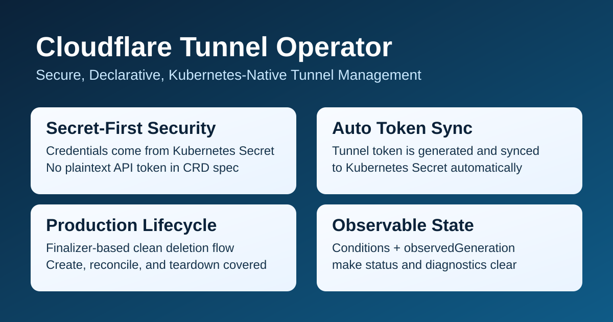

# Cloudflare Tunnel Operator

[English](README.md) | [中文](README.zh-CN.md)

Cloudflare Tunnel Operator 通过 `CloudflareTunnel` CRD 以声明式方式管理 Cloudflare Tunnel。



## 快速开始

前置条件：

- 可访问的 Kubernetes 集群（已配置 `kubectl`）
- 具备 Tunnel 权限的 Cloudflare API Token
- Cloudflare Account ID

1. 创建凭据 Secret：

```yaml
apiVersion: v1
kind: Secret
metadata:
  name: cloudflare-credentials
  namespace: default
type: Opaque
stringData:
  api-token: <YOUR_CLOUDFLARE_API_TOKEN>
  account-id: <YOUR_CLOUDFLARE_ACCOUNT_ID>
```

2. 创建 `CloudflareTunnel` 资源：

```yaml
apiVersion: cloudflaretunnel.spotty.com.cn/v1alpha1
kind: CloudflareTunnel
metadata:
  name: my-tunnel
  namespace: default
spec:
  tunnelName: my-first-tunnel
  credentialsRef:
    name: cloudflare-credentials
  connector:
    image: cloudflare/cloudflared:2026.3.0
    replicas: 1
```

3. 应用资源清单：

```bash
kubectl apply -f demo.yaml
```

4. 查看 Tunnel 状态：

```bash
kubectl get cloudflaretunnel my-tunnel -n default -o yaml
```

当省略 `spec.tokenSecretRef` 时，Operator 默认会把 token 存到 `${metadata.name}-token`，并在 `status.tokenSecretName` 中回显实际 Secret 名称。

## 功能说明

该 Operator 会监听 `CloudflareTunnel` 资源，并保证：

- 目标 Cloudflare Tunnel 存在。
- 存放 Tunnel Token 的 Kubernetes Secret 被创建或更新。
- 每个 CloudflareTunnel 都会创建一套独立的 cloudflared Deployment。
- 状态字段（`tunnelID`、`tokenSecretName`、`observedGeneration`、conditions）反映当前对账结果。
- 删除资源时通过 finalizer 清理云端 Tunnel。

## 凭据模型

Cloudflare 凭据通过 `spec.credentialsRef` 引用的 Secret 提供。

Secret 必须包含以下 key：

- `api-token`
- `account-id`

CRD `spec` 不再支持直接填写明文凭据。

## 安装部署

使用 Kustomize：

```bash
make docker-build IMG=<image:tag>
make docker-push IMG=<image:tag>
make deploy IMG=<image:tag>
```

如需构建并推送多架构镜像：

```bash
make docker-buildx IMG=<image:tag>
```

默认镜像平台：

`linux/amd64,linux/arm64,linux/s390x,linux/ppc64le`

可通过 `PLATFORMS=<platforms>` 覆盖。

使用 Helm（CRD 通过 `crds/` 自动安装）：

```bash
helm install cloudflaretunnel-operator \
  oci://ghcr.io/warjiang/charts/cloudflaretunnel-operator \
  --version <x.y.z> \
  --namespace cloudflaretunnel-operator-system \
  --create-namespace
```

升级：

```bash
helm upgrade cloudflaretunnel-operator \
  oci://ghcr.io/warjiang/charts/cloudflaretunnel-operator \
  --version <x.y.z> \
  --namespace cloudflaretunnel-operator-system
```

卸载：

```bash
helm uninstall cloudflaretunnel-operator --namespace cloudflaretunnel-operator-system
```

说明：通过 Helm `crds/` 安装的 CRD 不会在 `helm uninstall` 时自动删除。

## 开发常用命令

- 编译 manager 二进制：`make build`
- 构建跨平台二进制：`make build-cross`
- 运行单元/控制器测试：`make test`
- 运行端到端测试：`make test-e2e`
- 本地运行控制器：`make run`
- 安装 envtest 依赖：`make setup-envtest`

跨平台二进制输出目录：`dist/<goos>-<goarch>/manager`

默认二进制平台：

`linux/amd64,linux/arm64,linux/s390x,linux/ppc64le,darwin/arm64`

可通过 `BINARY_PLATFORMS=<platforms>` 覆盖。

## 贡献

详见 [CONTRIBUTING.md](CONTRIBUTING.md)。
